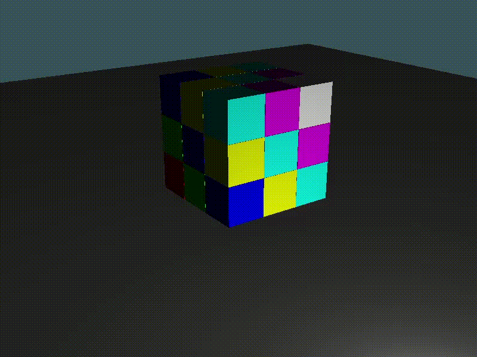
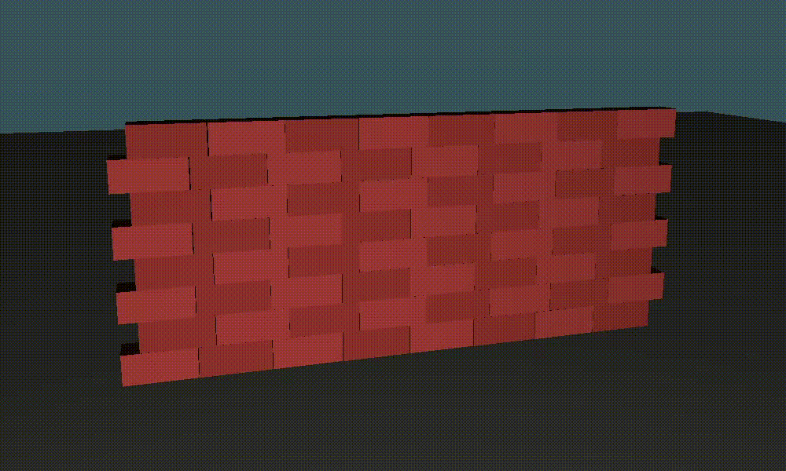

# raw-physics

Welcome to raw-physics, a real-time rigid body physics simulator.





Build and run to see more examples!

## Building

### Linux and OS X

You need libglew-dev and libglfw3-dev. Simply run:

```bash
$ make
```

The binary will be available in `./bin/release/raw-physics`.

### Windows

MSVC is a prerequisite. Simply run:

```bat
> build.bat
```

The binary will be available in `./bin/raw-physics`.