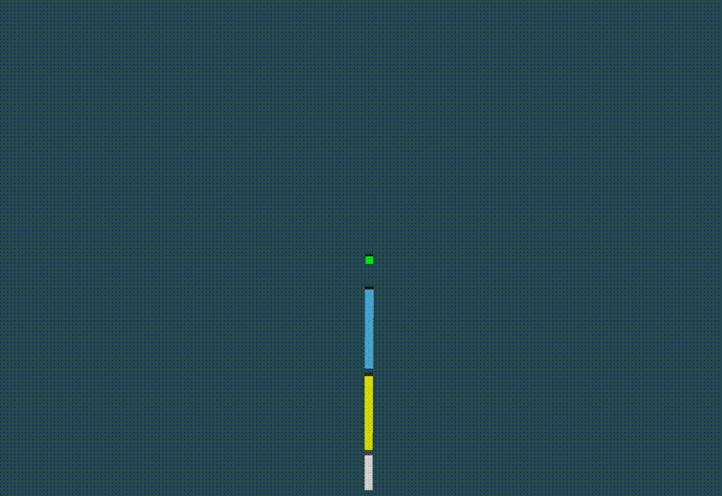

# raw-physics

Welcome to raw-physics, a real-time rigid body physics simulator.




Build and run to see more examples!

## Building

### Linux and OS X

You need libglew-dev and libglfw3-dev. Simply run:

```bash
$ make
```

The binary will be available in `./bin/release/raw-physics`.

### Windows

MSVC is a prerequisite. Simply run:

```bat
> build.bat
```

The binary will be available in `./bin/raw-physics`.

## References

Collision response was implemented based on *Detailed Rigid Body Simulation with Extended Position Based Dynamics* [1]. Collision detection was implemented with the help of *GJK* [2] and *EPA* [3]. The contact manifold generation was implemented using *Sutherland-Hodgman algorithm* [4]	in 3-dimensions, *Robust Contact Creation for Physics Simulations* [5] and the *Collision Manifolds Tutorial from Newcastle University* [6].

- [1] https://dl.acm.org/doi/10.1111/cgf.14105
- [2] https://ieeexplore.ieee.org/document/2083
- [3] https://graphics.stanford.edu/courses/cs468-01-fall/Papers/van-den-bergen.pdf
- [4] https://dl.acm.org/doi/10.1145/360767.360802
- [5] http://media.steampowered.com/apps/valve/2015/DirkGregorius_Contacts.pdf
- [6] https://research.ncl.ac.uk/game/mastersdegree/gametechnologies/previousinformation/physics5collisionmanifolds/